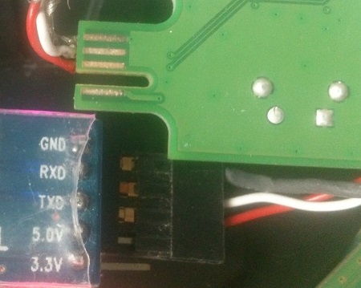

For WD MyCloud Device
=====================

Get access when device is not booting:

If it is already open: try a serial cable and get access to the console.
Maybe it is just a network configuration problem?

You need a 3,3V cable (these cables cost just about 5 Euro)

You don't need to solder anything to the board (like I did on the foto), but then you need an edge connector with the right distances.

Without opening
---------------

The Bootloader (called barebox, and is stored in FLASH, so it is not related
to anything on the disk) can be triggered to use TFTP when receiving a "magic packet".

Trigger TFTP
------------

Obviously you need to know how to setup this. "dnsmasq" is your friend for this.

You also need to send a "Magic Packet" to trigger the TFTP load.

Use "rawping.c" to send this:

Compile:

    gcc -o rawping rawping.c

Start:

    sudo rawping eth0 <mac of device>

This will trigger a download via tftp of a file called 'startup.sh'.

The different Startup Files
---------------------------

- `startup-system.sh`
  This will start the system as it would normally start.

- `startup-busybox-init.sh`
  This will start the system, but will give you a shell before init is called.
  It requires two things: 
  1. A serial console so you can type things to that shell
  2. A busybox already in your root file system!
  But with 1) you don't need the tftp for this, as you can type the commands of the script to the console of the bootloader barebox.

- `startup-uImage.sh`
  This will trigger the download of uImage and start the system inside the initramfs of uImage

Complete new setup
==================

use `build-sys.sh` for this:

Requirements:
- it needs the tar file with GPL Sources from WD
- extract this to the same directoy as the build-sys script
- you have to install a cross compiler `sudo apt-get install g++-4.7-arm-linux-gnueabihf`
- the script itself will download and compile busybox and finally generate a uImage that can be loaded via tftp to the box.
- Especially the busybox can be configured via `make menuconfig` if you need different tools
- ...?
